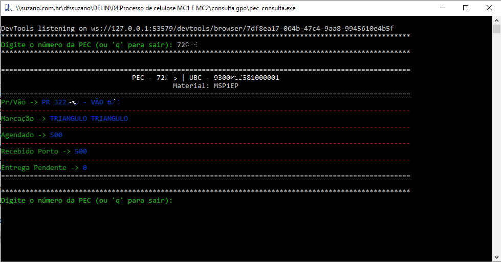

# Documentação

## Descrição do Projeto

O projeto consiste em um programa que obtém informações relacionadas a uma PEC por meio do sistema GPO (Gestão Portuária) utilizando web scraping. O programa exibe as informações no terminal.

## Arquivos do Projeto

O projeto é composto pelos seguintes arquivos:

- `main.py`: Arquivo principal do projeto. Contém a função `main()` responsável por controlar o fluxo do programa. Inicia uma instância do `GpoController` e `ShowInfoTerminal`, exibe um prompt para digitar o número da PEC e obtém as informações correspondentes. O programa continua em um loop até que o usuário digite 'q' para sair.

- `show_info_terminal.py`: Contém a classe `ShowInfoTerminal`, responsável por exibir as informações no terminal. Possui métodos para exibir uma lista de itens de PEC, solicitar uma entrada de texto e exibir uma mensagem de falha.

- `browser.py`: Contém a classe `BrowserController`, uma classe base para controle do navegador. Utilizada como classe pai pela classe `GpoController` para encapsular a lógica de controle do navegador. Usa a biblioteca Selenium para interagir com o navegador Chrome.

- `gpo_controller.py`: Contém a classe `GpoController`, responsável por obter informações do sistema GPO. Herda da classe `BrowserController` e inclui métodos para realizar o login no sistema, obter informações de PR/Vão e outras informações relacionadas à PEC.

- `gpo_model.py`: Armazena as informações do site de acesso, como links e credenciais de acesso ao sistema GPO. No código fornecido, ele é importado.

## Fluxo de Execução

O programa segue o seguinte fluxo de execução:

1. A função `main()` em `main.py` é executada.
2. É criada uma instância do `GpoController` e do `ShowInfoTerminal`.
3. O programa entra em um loop infinito.
4. O usuário é solicitado a digitar o número da PEC.
5. Se o usuário digitar 'q', o programa exibe uma mensagem de encerramento e sai do loop.
6. Caso contrário, o programa exibe uma mensagem indicando que está aguardando retorno.
7. O `GpoController` é usado para obter as informações de PR/Vão e outras informações relacionadas à PEC.
8. O programa exibe as informações no terminal usando a classe `ShowInfoTerminal`.
9. O programa repete o loop para solicitar uma nova entrada do usuário.
10. Quando o usuário digitar 'q', o programa encerra, fecha o navegador e exibe uma mensagem de encerramento final.

### Requisitos de Dependência

O projeto possui as seguintes dependências que devem ser instaladas para executá-lo corretamente:

- `halo`: Biblioteca para exibir spinners no terminal.
- `colorama`: Biblioteca para estilização de cores no terminal.
- `selenium`: Biblioteca para automação de navegador.

Certifique-se de ter as dependências instaladas antes de executar o projeto.

## Executando o Projeto

Siga as instruções abaixo para executar o projeto:

1. Certifique-se de ter o Chrome instalado em seu sistema, pois o projeto utiliza o ChromeDriver para controlar o navegador Chrome.
2. Execute o arquivo `main.py` para iniciar o programa.
3. Digite o número da PEC quando solicitado e pressione Enter.
4. O programa exibirá as informações da PEC no terminal.
5. Repita o passo 3 para consultar outras PECs.
6. Para sair do programa, digite 'q' e pressione Enter.

